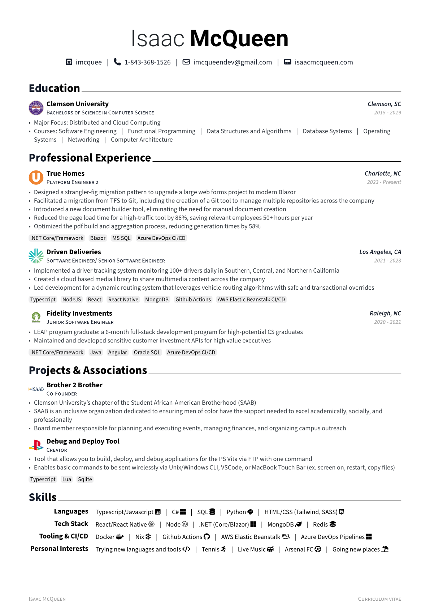

# CV



Credit to mintyfrankie for the Typst template [Brillant CV](https://github.com/mintyfrankie/brilliant-CV).

## Build

Build PDF
```bash
typst c cv.typ cv.pdf
```
Build PNG
```bash
typst c cv.typ cv.png
```
